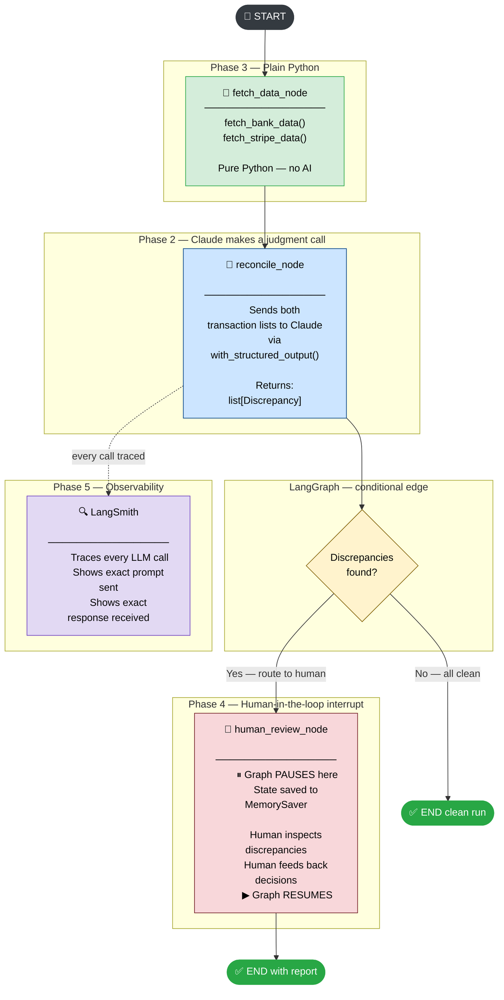

# Learning to Build AI Agents — A Beginner's Guide

> This project is your first real AI agent. By the end of reading this, you will understand
> not just *what* we built, but *why* every piece exists — and how to use these same ideas
> to build agents for real work.

---

## What Did We Actually Build?

Imagine you work at a company. Every month, the bank sends you a statement listing all the
money that moved. Stripe (your payment processor) also sends you a list. Your job is to make
sure both lists match. If they don't — something went wrong.

Doing this by hand for hundreds of transactions is slow and error-prone. So we built a
**computer program that does it automatically** — and when it finds something suspicious,
it stops and asks a human (you) what to do before continuing.

That program is called an **agent**.

---

## The Big Idea: What is an Agent?

A regular program follows a fixed script:

```
Step 1 → Step 2 → Step 3 → Done
```

An **agent** is smarter. It can:
- **Make decisions** at each step (not just follow a script)
- **Use AI** to handle fuzzy, judgment-based problems
- **Pause and ask a human** when it is not sure
- **Resume** exactly where it left off after getting an answer

Think of it like a very smart assistant who does 90% of the work, flags the hard 10% for you,
waits for your answer, and then finishes the job.

---

## The Three Building Blocks (Learn These First)

Everything in this project — and in every real-world agent — comes down to three things:

### 1. State — "What does the agent know right now?"

State is a container that holds all the information the agent needs.
Think of it like a whiteboard that every part of the agent can read and write on.

```python
class AgentState(TypedDict):
    bank_transactions: list[BankTransaction]      # what the bank says
    stripe_transactions: list[StripeTransaction]  # what Stripe says
    discrepancies: list[Discrepancy]              # differences found
    human_decisions: dict[int, str]               # what the human decided
    status: str                                   # where are we right now
```

**The rule:** every node (step) in the agent reads from state and writes back to state.
Nothing is stored in variables between steps — only state survives.

---

### 2. Nodes — "What does the agent do at each step?"

A node is just a Python function. It receives the current state, does something, and returns
an updated state.

```python
def fetch_data_node(state):       # receives state
    bank = fetch_bank_data()      # does something
    return {**state,              # returns updated state
            "bank_transactions": bank}
```

You can have as many nodes as you want. Each one does ONE job. This is important —
small, focused nodes are easy to debug and easy to replace.

---

### 3. Edges — "What happens next?"

Edges connect nodes together. There are two kinds:

**Fixed edge** — always goes to the same next node:
```
fetch_data_node  →  reconcile_node   (always)
```

**Conditional edge** — a function decides what happens next:
```
reconcile_node  →  human_review_node   (if discrepancies found)
reconcile_node  →  END                 (if everything is clean)
```

The conditional edge is where the agent's "intelligence" lives. It is not AI — it is just
Python — but it lets the agent take different paths depending on what it found.

---

## The Graph — Putting It All Together

When you connect state + nodes + edges, you get a **graph**. Picture it like a flowchart:

```
START
  |
  v
[fetch_data_node]        ← pulls bank + Stripe records into state
  |
  v
[reconcile_node]         ← sends records to Claude AI, gets back a list of problems
  |
  v
(decision: problems found?)
  |                 |
  v                 v
[human_review]     END   ← if clean, we are done
  |
  v
END                       ← after human reviews
```

LangGraph manages this flowchart for you. Your job is just to write the nodes and describe
the connections.

### Full agent flow — interactive diagram

This is the complete agent after all 5 phases. Each node is colour-coded by what powers it.



| Colour | What it means |
|---|---|
| 🟢 Green | Plain Python — no AI involved |
| 🔵 Blue | LangChain + Claude — AI makes a judgment call |
| 🟡 Yellow | LangGraph — routing and orchestration logic |
| 🔴 Red | Human-in-the-loop — graph pauses and waits for input |
| 🟣 Purple | LangSmith — observability, traces every LLM call |

> The shape of the graph barely changes after Phase 2. What deepens is the *capability* of each node.

---

## Without AI vs With This Agent

Same reconciliation task, two approaches. The script works for a demo. The agent works in the real world.

| | Plain Script | This Agent |
|---|---|---|
| **How it runs** | Top-to-bottom, one shot | State machine — steps are explicit nodes |
| **What Claude returns** | A free-text string you must parse | A typed Pydantic object — no parsing needed |
| **Fuzzy mismatches** | Script guesses or crashes | Claude decides; low confidence → escalate |
| **If it fails mid-run** | Restart from scratch, lose everything | Checkpointer saves state — resume from last step |
| **Human review** | `input()` blocking call — process hangs | Graph interrupts cleanly, human decides later, graph resumes |
| **Debugging** | Print statements everywhere | Inspect `AgentState` at any node; LangSmith traces every LLM call |
| **Adding a new step** | Refactor the whole script | Add one node, wire one edge — rest of graph unchanged |
| **Merchant name variants** | Hard-coded lookup dict | Claude calls a `@tool` at runtime when it decides it needs more info |

```python
# Script approach — what breaks
result = call_claude(bank_txns, stripe_txns)  # returns "I found 2 issues: ..."
discrepancies = parse_my_string(result)        # regex hell — fragile
if discrepancies:
    decision = input("Approve? ")              # process hangs; close terminal = lose everything
```

```python
# Agent approach — what we build
# Claude returns a typed object, not a string
result: ReconciliationResult = reconcile_node(state)
# state is checkpointed after every node
# graph pauses before human_review_node
# human comes back tomorrow:
app.invoke(None, config)   # resumes exactly where it left off
```

---

## What We Built Phase by Phase

### Phase 1 — Laying the Foundation ✅ Complete

**What you learned:** Define your data shapes BEFORE writing any logic.

| Layer | Active | Role |
|---|---|---|
| Plain Python | ✅ | Everything — models, state, the node function |
| LangGraph | ✅ | `StateGraph`, `add_node`, `add_edge`, `compile`, `invoke` |
| LangChain / Claude | ❌ | Not yet — no LLM calls in Phase 1 |

We created Pydantic models for every piece of data:
- `BankTransaction` — one row from the bank
- `StripeTransaction` — one row from Stripe
- `Discrepancy` — a problem found between the two

**Why this matters for real agents:** If you start coding without knowing what your data looks
like, you will rewrite everything twice. Always design your data first.

**The test:** Run `python main.py`. You should see transactions printed. If nothing prints,
check that your `.env` file has the API key.

---

### Phase 2 — The AI Step ⬜ Next

**What you learned:** How to give the AI a question and get back a structured answer.

| Layer | Active | Role |
|---|---|---|
| Plain Python | ✅ | Conditional edge function, stub nodes |
| LangGraph | ✅ | `add_conditional_edges` — routing between nodes |
| LangChain / Claude | ✅ | `reconcile_node` calls Claude; `with_structured_output` returns a typed object |

The key line in the whole project:
```python
llm = get_llm().with_structured_output(ReconciliationResult)
```

This tells Claude: "Do not give me a paragraph of text. Give me a Python object that matches
this exact shape." Claude returns a `ReconciliationResult` containing a list of `Discrepancy`
objects — real Python objects your code can work with.

**Why this matters:** In the real world, you cannot parse AI responses with `split()` or
regex — they are too unpredictable. `with_structured_output()` solves this completely.

**The conditional edge:**
```python
def route_after_reconcile(state):
    if state["discrepancies"]:
        return "human_review_node"
    return END
```
Clean data? End immediately. Problems found? Ask a human. This is the agent "deciding" — but
notice it is just an `if` statement. The AI's job was to produce the discrepancies. The
routing decision is plain Python.

**The test:** Run with clean transactions → should print `status: clean`.
Run with a $0.50 mismatch → should route to `human_review_node`.

---

### Phase 3 — Real Messy Data ⬜ Upcoming

**What you learned:** The hard part of any agent is the data, not the AI.

| Layer | Active | Role |
|---|---|---|
| Plain Python | ✅ | `fetch_bank_data()`, `fetch_stripe_data()`, `fetch_data_node` |
| LangGraph | ✅ | New first node wired in: `fetch_data_node → reconcile_node` |
| LangChain / Claude | ✅ | Same reconcile call — now fed genuinely messy data |
| `@tool` (stretch) | ✅ | `lookup_merchant_alias` — Claude calls this at runtime when it needs more info |

We added 7 types of real-world messiness:
| Type | Example |
|---|---|
| Rounding difference | Bank: $120.00 / Stripe: $120.02 |
| Missing transaction | Netflix on bank, nothing on Stripe |
| Duplicate charge | Gym membership posted twice |
| Refund netting | +$200 charge and -$200 refund → should cancel out |
| Timezone shift | Bank: June 7 / Stripe: June 8 (same transaction) |
| Merchant name variants | "AMZN MKTP US" vs "Amazon.com" |
| Missing from bank | Spotify on Stripe, nothing on bank |

We also added a `@tool` — `lookup_merchant_alias` — that Claude can *call* during
reconciliation to check if two merchant names are the same vendor. This is tool use: the AI
decides when it needs more information and calls the tool itself.

**Why this matters:** Real enterprise data is never clean. Your agent needs to handle
ambiguity gracefully — not crash, not guess silently, but escalate when unsure.

**The test:** Run `main.py`. You should see all 5–6 discrepancies found. Notice which ones
Claude handles automatically (refund pair, merchant aliases) vs. which ones it flags.

---

### Phase 4 — Human in the Loop ⬜ Upcoming

**What you learned:** How to pause an agent mid-run and resume it later.

| Layer | Active | Role |
|---|---|---|
| Plain Python | ✅ | `human_review_node` reads `human_decisions`, writes final summary |
| LangGraph | ✅ | `MemorySaver`, `interrupt_before`, `get_state`, `update_state` |
| LangChain / Claude | ✅ | Same reconcile call as Phase 2/3 |
| Human | ✅ | Inspects discrepancies, provides decisions, triggers resume |

Two new concepts:

**Checkpointer (`MemorySaver`)** — saves the entire state of the graph after every node.
Like a save file in a video game. The agent can be stopped, and restarted exactly where it
left off.

**Interrupt** — tells LangGraph "stop just before this node and wait":
```python
graph.compile(
    checkpointer=MemorySaver(),
    interrupt_before=["human_review_node"]
)
```

**The two-call pattern** — this is the most important pattern in agentic systems:
```python
# Call 1: run until paused
app.invoke(initial_state, config)

# (Human reviews discrepancies here — could be hours later)
snapshot = app.get_state(config)         # read frozen state

# Call 2: inject decision + resume
app.update_state(config, {"human_decisions": {...}})
app.invoke(None, config)                 # None = "resume, no new input"
```

**Why this matters:** Real enterprise agents cannot run unattended on financial data.
A human must approve anything the AI is not certain about. The interrupt pattern makes this
possible without losing the agent's progress.

**The test:** Watch the output carefully. After Step 1, `human_review_node` should NOT have
printed yet. After Step 5 (resume), it should. That gap is the "pause" — the agent was
frozen waiting for you.

---

### Phase 5 — Making It Production-Ready ⬜ Upcoming

**What you learned:** How to observe, stress-test, and expose your agent.

| Layer | Active | Role |
|---|---|---|
| LangSmith | ✅ | Traces every LLM call — exact prompt in, exact response out |
| LangChain / Claude | ✅ | Prompt is iterated based on what the traces reveal |
| FastAPI (stretch) | ✅ | `POST /run` and `POST /resume` wrap the graph as a REST API |

**LangSmith tracing** — flip one env var and every LLM call is logged forever:
- Exact prompt sent to Claude
- Exact response received
- How long it took
- How many tokens it used

This is how you debug when an agent behaves unexpectedly in production. You stop guessing
what the AI saw and start knowing.

**Stress testing** — we added an intentionally ambiguous transaction pair:
- Bank: "ADOBE SYSTEMS" — $54.99
- Stripe: "Adobe Creative Cloud" — $54.99

Same amount, same date, different name. Is it the same transaction or two different ones?
The correct answer: resolve via alias tool (both map to "Adobe"), treat as matched.
The agent handled it correctly.

**The escalation rule** — if confidence is "low", the agent MUST escalate, never auto-resolve.
This is critical for financial agents: a wrong auto-resolution can mean real money lost.

**FastAPI** — the agent is now a web service. Any other system (a dashboard, a Slack bot,
a scheduled job) can call it via HTTP:
```
POST /run     → starts reconciliation, returns discrepancies
POST /resume  → submits human decisions, returns final summary
```

---

## How to Test Everything

### Quick smoke test (2 minutes)
```bash
.venv\Scripts\python.exe main.py
```
Expected: 6 steps print, 5 discrepancies found, graph completes with `complete_with_escalations`.

### Test the API (5 minutes)
```bash
# Terminal 1 — start the server
.venv\Scripts\uvicorn.exe agent.api:app --reload

# Terminal 2 — run a reconciliation
# Open http://127.0.0.1:8000/docs in your browser
# Click POST /run → Execute → copy the thread_id
# Click POST /resume → paste thread_id + enter decisions → Execute
```

### Enable LangSmith tracing (10 minutes)
1. Sign up free at https://smith.langchain.com
2. Get your API key from Settings
3. Edit `.env`:
   ```
   LANGCHAIN_TRACING_V2=true
   LANGCHAIN_API_KEY=your_key_here
   ```
4. Run `main.py` again
5. Open LangSmith → you will see every LLM call with full prompt + response

### Experiment (ongoing)
Try these one at a time to deepen your understanding:

| Experiment | What to change | What to observe |
|---|---|---|
| Add a new discrepancy type | Edit `fetch_bank_data()` in `agent/data.py` | Does Claude catch it? |
| Break the prompt | Remove the refund-netting rule from `RECONCILE_SYSTEM_PROMPT` in `agent/graph.py` | Does it start flagging refunds? |
| Add a new merchant alias | Edit `MERCHANT_ALIASES` in `agent/tools.py` | Does Claude resolve it? |
| Make a transaction ambiguous | Change an amount by $0.01 | Does confidence change? |
| Change routing logic | Edit `route_after_reconcile` in `agent/graph.py` | Does the graph path change? |

---

## The Mental Models That Transfer to ANY Agent

These are the things you have now learned by doing, not just reading:

### 1. State is everything
Design your state first. If you cannot describe the state at every step of your agent,
you are not ready to write code yet.

### 2. Separate what from how
- **What to decide** → LLM
- **How to route** → Python
- **Where to get data** → deterministic code (APIs, databases, files)

Never ask the AI to filter a list by date. Never ask Python to judge whether two merchant
names are the same vendor. Each tool does what it is good at.

### 3. Structured output always
`with_structured_output()` is not optional. Raw LLM text in a production agent is a bug
waiting to happen. Always bind a schema to what you need back.

### 4. Low confidence → escalate, never guess
Any agent making decisions with real consequences (money, data, user-facing actions) must
have a human exit path. "When in doubt, escalate" is a rule, not a suggestion.

### 5. Debug state first, then prompt
If the agent behaves wrong:
1. Print the state at the failing node
2. Is the state correct? If not, fix the node that produces it
3. Only THEN look at the prompt

Debugging prompt and state simultaneously is chaos.

---

## How This Prepares You for Enterprise Agents

The reconciliation agent is a toy problem, but every pattern in it appears in real enterprise agents:

| This project | Real-world equivalent |
|---|---|
| Bank vs Stripe records | Any two data sources that must agree (ERP vs CRM, SAP vs Salesforce) |
| `fetch_data_node` | Connector nodes that pull from real APIs or databases |
| `reconcile_node` | Any AI step that compares, classifies, or summarises |
| `lookup_merchant_alias` | Tools that give the AI access to company knowledge bases or lookup tables |
| `interrupt_before` | Approval workflows, compliance gates, manager sign-off |
| `MemorySaver` | Production checkpointers backed by PostgreSQL or Redis |
| FastAPI endpoints | The surface that a frontend, Slack bot, or orchestrator calls |

To build your next agent:
1. **Define the problem** — what does a human do today that you want to automate?
2. **Map the steps** — what are the distinct stages? (fetch, analyse, decide, act)
3. **Design state** — what information needs to survive between steps?
4. **Decide what needs AI** — only the judgment-based steps. Everything else is code.
5. **Add human gates** — where must a human approve before the agent continues?
6. **Test with messy data** — clean data always works. Real data never does.

---

## File Map

```
Agents/
├── agent/
│   ├── models.py     ← data shapes (BankTransaction, AgentState, etc.)
│   ├── data.py       ← simulated data sources with 7 discrepancy types
│   ├── tools.py      ← lookup_merchant_alias @tool
│   ├── graph.py      ← nodes, edges, prompt, build_graph()
│   └── api.py        ← FastAPI web service (POST /run, POST /resume)
├── main.py           ← full demo: pause → inspect → decide → resume
├── AGENTS.md         ← learning reference for this session
├── PLAN.md           ← step-by-step checklist (all done)
├── README.md         ← you are here
└── .env              ← API keys (never share or commit this file)
```

---

## What to Build Next

Now that you understand the pattern, here are three agent ideas that use the same building
blocks — each slightly harder than the last:

**Beginner:** Invoice approval agent
- Fetch invoices from an email inbox
- AI extracts vendor, amount, due date
- Routes invoices above $10,000 to a manager for approval
- Resumes after approval, marks invoice as approved in the system

**Intermediate:** Customer support triage agent
- Receives incoming support tickets
- AI classifies urgency and category
- Low-urgency → auto-reply with FAQ
- High-urgency → interrupt, human writes response, agent sends it

**Advanced:** Data quality agent
- Runs on a schedule (daily)
- Pulls records from a database
- AI identifies anomalies, duplicates, missing fields
- Generates a report, flags critical issues to a Slack channel
- Waits for acknowledgement before archiving

All three follow the same pattern: fetch → AI step → conditional route → human gate → resume.
You already know how to build this.

---

*The best way to learn agents is to build one, break it, and understand why it broke.
You have done the first part. Now experiment.*
